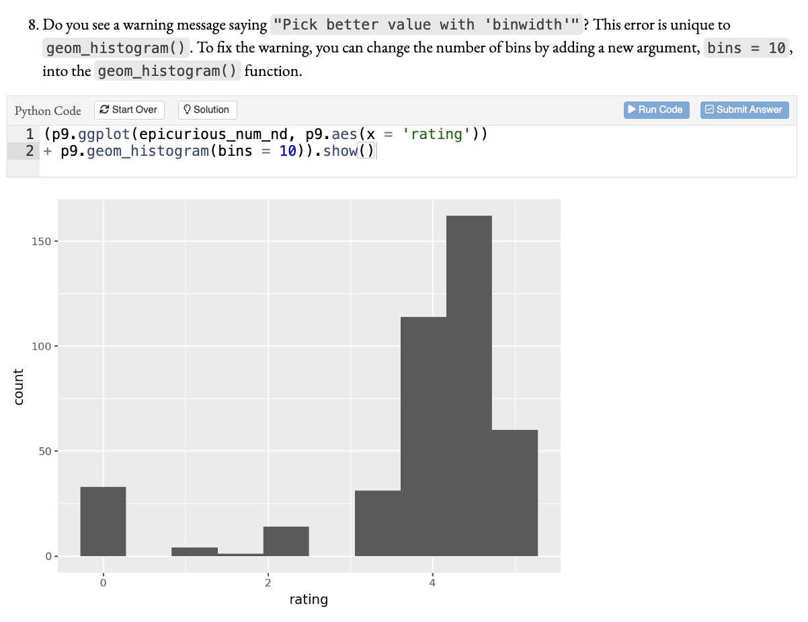
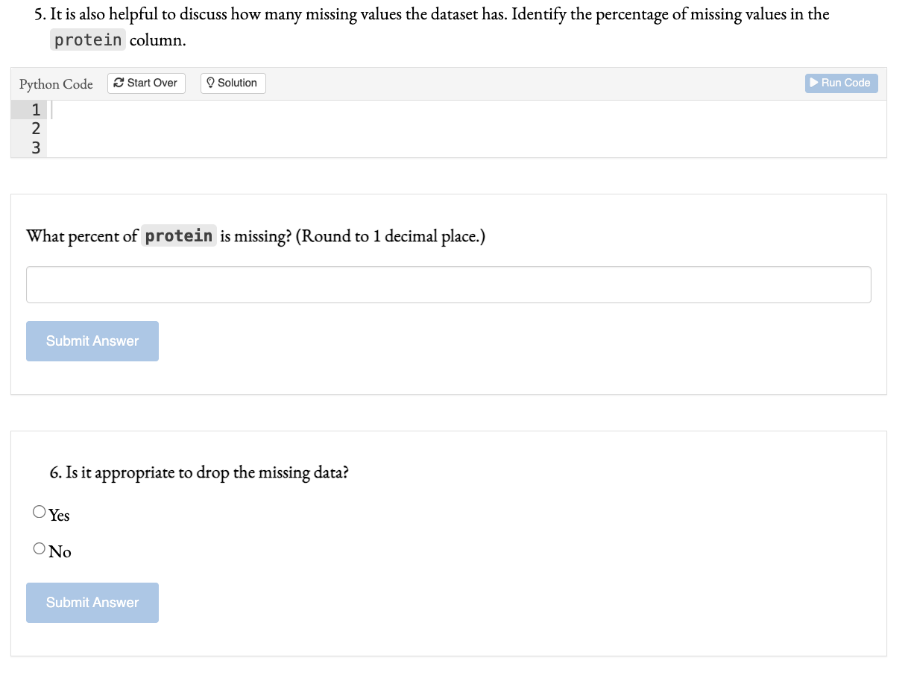
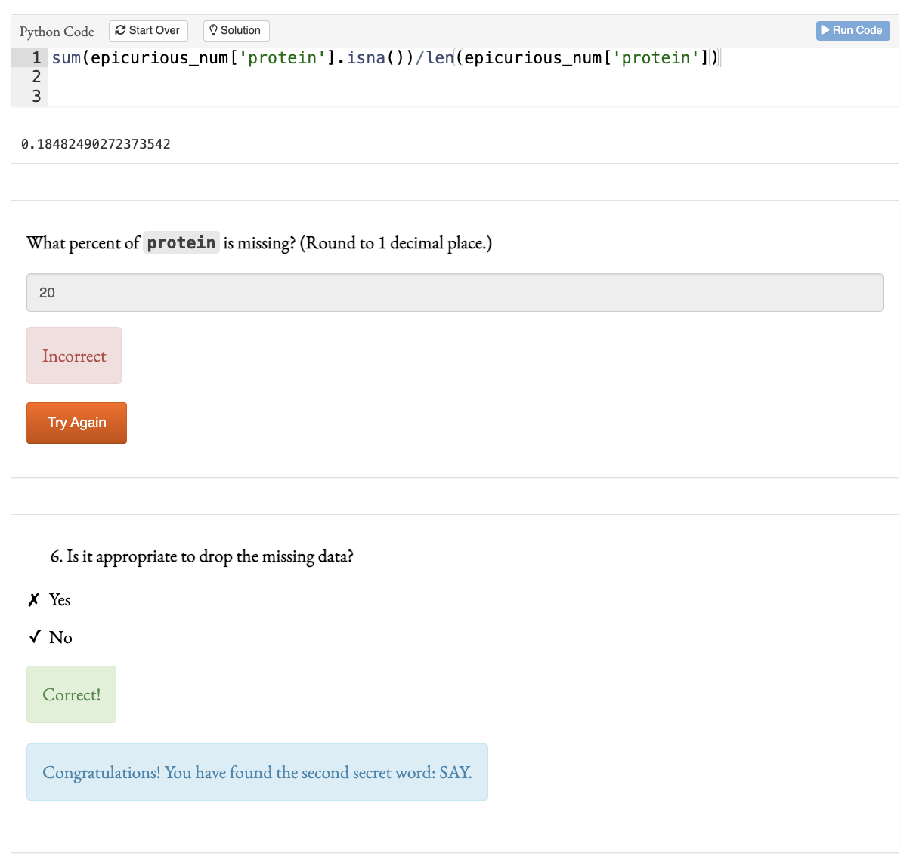

```{r setup, include=FALSE}
knitr::opts_chunk$set(echo = FALSE, tidy = TRUE)
options(tinytex.tlmgr_update = FALSE)

library(reticulate)

use_condaenv("/Users/amynussbaum/Library/r-miniconda-arm64/envs/r-reticulate/bin/python")

library(connectapi)
library(dplyr)
library(ggplot2)
library(kableExtra)
library(lubridate)
library(stringr)
library(tidyr)

as_of_date <- today()
days_back <- 1000
top_n <- 30
report_from <- as_of_date - ddays(days_back)

client <- connect(server = "https://posit.ds.uchicago.edu/",
                  api_key = "XraWPYODS53ND3Y0Mw72coXKfnlQqmqj")

content_info <- connectapi::get_content(client) |>
  hoist(owner, owner_username = "username") |>
  select(guid, name, title, owner_username, dashboard_url)

usage_shiny <- get_usage_shiny(client,
                               from = report_from,
                               to = as_of_date,
                               limit = Inf
)

usage_non_shiny <- get_usage_static(client,
                                    from = report_from,
                                    to = as_of_date,
                                    limit = Inf
) |>
  rename(started = time) |>
  mutate(ended = started)

```

# Introduction

## Abstract

\vspace{10mm}

> Lab materials provide students opportunities for practice in new domains. However, existing tools for implementing interactive data science labs require installing software, which distracts from core lessons. We leverage R’s instructional ecosystem for browser-based, self-guided Python tutorials for data science courses. These tutorials require minimal setup, ideal for use across different classroom modalities. R’s framework can be successfully adapted for Python labs, lowering barriers to entry and strengthening student learning of core data science concepts.

## Data Science as an Emerging Field

The field of data science has rapidly expanded in recent years, and approaches to *designing introductory data science course materials* vary widely, depending on the background of the instructor (Hardin et al., 2015). 

* Statistics departments: R and its extensive range of pedagogical tools
* Computer Science departments: Python 
* Still others: language agnostic 

## Tools for Designing Course Materials

* Python-based courses rely on Jupyter for interactive work. 
* R's more mature teaching libraries do not run in Jupyter.
* Comparable Python tools either:
  + Do not work as well, or 
  + Are unfamiliar to statistics faculty new to teaching Python (Brunner & Kim, 2016). 

Answer: Shiny Apps, written in R to teach Python, combined with PositCloud 

* Simple, interactive assignments, 
* Lowering barriers for beginners (Çetinkaya-Rundel and Rundel, 2018; Stoudt et al., 2022). 

## Motivation 

Consider teaching a group of students how to create a histogram:

\begin{multicols}{2}

\scriptsize

\begin{itemize}
  \item[\scriptsize \textbullet] Show students what a Jupyter notebook is and how it works (i.e., the difference between code and markdown cells, shortcuts, etc.).
  \item[\scriptsize \textbullet] Open a Jupyter notebook. Either:
  \begin{itemize}
    \item[\tiny \textbullet] \tiny Open a terminal and launch an empty notebook. 
    \begin{itemize}
      \item[\tiny \textbullet] \tiny Show students what the terminal is.
      \item[\tiny \textbullet] \tiny Show students how to change their directories.
    \end{itemize}
    \item[\tiny \textbullet] \tiny Download and install Anaconda Navigator.
  \end{itemize}
  \item[\scriptsize \textbullet] \scriptsize Install relevant graphics modules.
   \begin{itemize}
     \item[\tiny \textbullet] \tiny Show students what the terminal is.
     \item[\tiny \textbullet] \tiny Show students how to install packages.
    \end{itemize}
  \item[\scriptsize \textbullet] \scriptsize Load data into your workspace.
    \begin{itemize}
      \item[\tiny \textbullet] \tiny Download the dataset.
      \item[\tiny \textbullet] \tiny Save the dataset in the same directory as the notebook.
      \begin{itemize}
        \item[\tiny \textbullet] \tiny Review the file structure of your computer to understand how to navigate to a new directory.
      \end{itemize}
    \end{itemize}
  \item[\scriptsize \textbullet] \scriptsize \textbf{Actually make the histogram.}
\end{itemize}

\normalsize

\vspace{5mm}

\begin{itemize}
  \item[\normalsize \textbullet] Click on a link. 
  \item[\normalsize \textbullet] Sign into the website. 
  \item[\normalsize \textbullet] \textbf{Actually make the histogram.}
  \item[]
  \item[]
  \item[]
  \item[]
  \item[]
  \item[] 
  \item[]
  \item[] 
  \item[]
  \item[] 
\end{itemize}

\end{multicols}

## Example 1: Histogram

{width=80%, fig-align="center"}

## Example 2: Question Types

{width=80%, fig-align="center"}

## Example 3: Responses

{width=80%, fig-align="center"}

## Research Questions

\vspace{10mm}

* **RQ1**: Can frameworks developed for R-based courses be adapted for teaching data science in Python? 
* **RQ2**: Do browser-based, interactive labs improve understanding of data science concepts? 
* **RQ3**: Do such labs reduce barriers for students from non-coding backgrounds and increase confidence and self-efficacy?

# RQ1

## RQ1

\vspace{10mm}

Can frameworks developed for R-based courses be adapted for teaching data science in Python? 

\vspace{10mm}

> Yes! With some caveats--but mostly yes.

## Statistics by Class and Section

```{r, echo = FALSE}
quarter <- c("Winter 2025", "", "Spring 2025", "", "Sept. 2025", "Autumn 2025", "Winter 2026", "", "", "Spring 2026", "", "", "Total")
class <- c("119", "119", "119", "119", "119", "119", "119", "119", "120", "119", "119", "120", 2)
section <- c("02", "03", "01", "02", "01", "01", "01", "02", "01", "01", "02", "01", 12)
students <- c(34, 33, 22, 39, 12, 38, 19, 44, 29, 41, 37, 25, "373*")
format <- c("Required In-Class", "Asynchronous", "Asynchronous", "Required, In-Class", "Asynchronous", 
            "Asynchronous/Optional Lab", "Required Lab", "Required Lab", "Various",  "Required Lab", "Required Lab", "Various", "")

section_stats <- cbind(quarter, class, section, students, format)

kable(section_stats, format = "latex", escape = FALSE, booktabs = TRUE, 
      col.names = c("Quarter", "Class", "Section", "Students", "Format"), 
      align = c("r", "c", "c", "c", "c"), linesep = "") |>
  row_spec(c(2, 4, 5, 6, 9, 12), hline_after = TRUE, extra_latex_after = "%") |>
  row_spec(c(0, 13), bold = TRUE) |>
  kable_styling(position = "center", font_size = 8)
```

## DATA119 Tutorials

```{r, echo = FALSE}
DATA119 <- c("Data 119 Lab 3.5 - VIF and Categorical Variables", "Data 119 Lab 7 - Clustering",                     
             "Data 119 Lab 4 - Logistic Regression", "Data 119 Lab 2 - Correlation and SLR",            
             "Data 119 Lab 3 - Assumption Checking and MLR", "Data 119 Lab 6 - kNN and Confusion Matrices",     
             "Data 119 Lab 1 - Data Wrangling", "Data 119 Lab 8 - SQL",                            
             "Data 119 Lab 5 - Regularization", "Data 119 Lab 9 - Review")

usage <- bind_rows(usage_shiny, usage_non_shiny) |>
  mutate(quarter = ifelse(as.Date(started) < as.Date("03-15-2025", format = "%m-%d-%Y"), "Winter 2025", 
                          ifelse(as.Date(started) < as.Date("06-07-2025", format = "%m-%d-%Y"), "Spring 2025", 
                                 ifelse(as.Date(started) < as.Date("09-12-2025", format = "%m-%d-%Y"), "Sept. 2025", 
                                        ifelse(as.Date(started) < as.Date("12-13-2025", format = "%m-%d-%Y"), "Autumn 2025",
                                               ifelse(as.Date(started) < as.Date("03-14-2026", format = "%m-%d-%Y"), "Winter 2026", "Spring 2026"))))), 
         quarter_start = ifelse(as.Date(started) < as.Date("03-15-2025", format = "%m-%d-%Y"), as.Date("01-06-2025", format = "%m-%d-%Y"), 
                          ifelse(as.Date(started) < as.Date("06-07-2025", format = "%m-%d-%Y"), as.Date("03-24-2025", format = "%m-%d-%Y"), 
                                 ifelse(as.Date(started) < as.Date("09-12-2025", format = "%m-%d-%Y"), as.Date("08-25-2025", format = "%m-%d-%Y"), 
                                        ifelse(as.Date(started) < as.Date("12-13-2025", format = "%m-%d-%Y"), as.Date("09-29-2025", format = "%m-%d-%Y"),
                                               ifelse(as.Date(started) < as.Date("03-14-2026", format = "%m-%d-%Y"), as.Date("01-05-2026", format = "%m-%d-%Y"), 
                                                      as.Date("03-23-2026", format = "%m-%d-%Y"))))))) |>
  mutate(time_spent = (ymd_hms(ended) - ymd_hms(started))) |>
  mutate(quarter_day = as.Date(started) - as.Date(quarter_start)) |>
  filter(time_spent > 300) |>
  #select(content_guid, user_guid, time_spent) |>
  group_by(content_guid) |>
  mutate(avg_time = mean(time_spent), med_time = median(time_spent), 
         Q1 = quantile(time_spent, probs = c(0.25)), 
         Q3 = quantile(time_spent, probs = c(0.75))) |>
  mutate(IQR = Q3 - Q1) |>
  mutate(max_time = Q3 + 1.5*IQR) |>
  filter(time_spent < max_time) |>
  left_join(content_info, by = c(content_guid = "guid")) |>
  # if title is NA then substitute with name
  mutate(title = coalesce(title, name))
  
usage_119 <- usage |>  
  filter(title %in% DATA119)

usage_byl_119 <- usage_119 |>
  group_by(title) |>
  summarise(tot_usage = n(), med_time = round(median(as.numeric(time_spent/60)))) |> 
  #mutate(title = paste0(str_split(title, pattern = " ")[c(3, 4)], collapse = " "))
  mutate(title = sapply(str_split(title, pattern = " "), function(x) paste(x[3], x[4])))

usage_byl_119$topics <- c("Data wrangling, summary statistics, data visualization", 
                          "More data visualization, correlation, simple linear regression, some assumption checking",
                          "More assumption checking, multiple linear regression, checking significance", 
                          "Categorical variables, multicollinearity, variance inflation factor", 
                          "Logistic regression, including new model fit statistics like the confusion matrix", 
                          "Cross validation, ridge regression, LASSO", 
                          "$k$-nearest neighbors classification and regression", 
                          "$K$-means and hierarchical clustering", 
                          "Structured Query Language, including joins", 
                          "DATA119 Quarter Review")
```

```{r, echo = FALSE}
centerText <- function(text){
    paste0("\\multirow{2}{*}[0pt]{", text, "}")
  }

colnames(usage_byl_119) <- c(centerText("Lab"), centerText("Sessions"), "Median Time (m)", centerText("Topics"))

kable(usage_byl_119, format = "latex", escape = FALSE, booktabs = TRUE, 
      #col.names = , 
      align = c("l", "r", "c", "l"), linesep = "\\addlinespace") |>
  kable_styling(position = "center", font_size = 7) |>
  row_spec(0, bold = TRUE) |>
  column_spec(1, width = "1.2cm") |>
  column_spec(2, width = "0.9cm") |>
  column_spec(3, width = "1.5cm") |>
  column_spec(4, width = "8cm")
```

## DATA119: Usage by Time

```{r, echo = FALSE, eval = FALSE, fig.height = 4, fig.width=8, fig.align = "center"}
ggplot(usage_119, aes(x = time_spent/60, y = title)) + 
  geom_boxplot(color = "#800000") + 
  geom_vline(xintercept = 50, color = "gray20") + 
  scale_x_continuous("Time Spent (minutes)", 
                     breaks = seq(from = 0, to = 150, by = 30)) + 
  scale_y_discrete("", limits = rev, 
                   labels = c("Lab 1", "Lab 2", "Lab 3", "Lab 3.5", "Lab 4",
                              "Lab 5", "Lab 6", "Lab 7", "Lab 8", "Lab 9")) + 
  theme(axis.text.y = element_text(hjust = -0.14)) #+ 
  #ggtitle("DATA119 Tutorial Usage by Time")
```

```{r, echo = FALSE, fig.height = 3.85, fig.width=8, fig.align = "center"}
usage_119_byq <- usage_119 |>
  group_by(quarter, quarter_day, title) |>
  summarise(usage = n()) |>
  filter(quarter_day > 0) |> 
  mutate(quarter = factor(quarter, levels = c("Winter 2025", "Spring 2025", 
                                              "Sept. 2025", "Autumn 2025", 
                                              "Winter 2026", "Spring 2026"))) |>
  filter(quarter != "Sept. 2025")

usage_119_byq |>
  mutate(
    #title = str_replace(title, "Data 119 Lab ", "") |>
      #str_replace(" -", ":"),
    title = as.factor(title),
    quarter_day = as.integer(quarter_day),
    quarter =
      str_replace(quarter, "Winter", "WI") |>
      str_replace("Spring", "SP") |>
      str_replace("Autumn", "AU") |>
      str_replace("20", "")
  ) |>
  uncount(usage) |>
  ggplot(aes(x = quarter_day, y = title, color = quarter)) +
  geom_count(
    position = position_dodge(width = 1),
    aes(alpha = after_stat(log(n)))
  ) +
  labs(
    y = "Data 119 Lab",
    x = "Day in Quarter"#,
    #caption = "Plot by Ryan McShane"
  ) +
  scale_x_continuous(breaks = scales::breaks_width(7, offset = 0)) + 
  scale_y_discrete("", limits = rev, 
                   labels = rev(c("Lab 1", "Lab 2", "Lab 3", "Lab 3.5", "Lab 4",
                              "Lab 5", "Lab 6", "Lab 7", "Lab 8", "Lab 9"))) +
  scale_color_manual(
    name = "Quarter",
    values = c(
      "WI 25" = "#A4343A",
      "SP 25" = "#DE7C00",
      "AU 25" = "#275D38",
      "WI 26" = "#007396",
      "SP 26" = "#59315F"
  )) +
  scale_alpha_continuous(range = c(0.2, 1)) +
  guides(alpha = "none") +
  theme(
    plot.caption = element_text(margin = margin(t = -15, unit = "pt")),
    plot.caption.position = "plot"
  )
```

## Usage for Lab 1: Data Wrangling

```{r, echo = FALSE, eval = TRUE, fig.height = 3.85, fig.width=8, fig.align = "center"}
# ggplot(usage_119_byq, aes(x = quarter_day, y = usage, color = quarter)) +
#   geom_line() +
#   facet_wrap(vars(title), ncol = 2, dir = "v") + 
#   scale_color_manual(name = "Quarter",
#                      values = c("Winter 2025" = "#A4343A", "Spring 2025" = "#DE7C00",
#                                 #"Sept. 2025" = "#EAAA00", 
#                                 "Autumn 2025" = "#275D38", 
#                                 "Winter 2026" = "#007396", "Spring 2026" = "#59315F")) + 
#   scale_x_continuous("Day of the Quarter") + 
#   scale_y_continuous("Usage (meaningful hits)") + 
#   theme(legend.position = "bottom") + 
#   ggtitle("DATA119 Tutorial Usage over the Quarter")

usage_lab1 <- usage_119_byq |>
  filter(title == "Data 119 Lab 1 - Data Wrangling")

ggplot(usage_lab1, aes(x = quarter_day, y = usage, color = quarter)) +
  geom_line() +
  scale_color_manual(name = "Quarter",
                     values = c("Winter 2025" = "#A4343A", "Spring 2025" = "#DE7C00",
                                #"Sept. 2025" = "#EAAA00",
                                "Autumn 2025" = "#275D38",
                                "Winter 2026" = "#007396", "Spring 2026" = "#59315F")) +
  scale_x_continuous("Day of the Quarter") +
  scale_y_continuous("Usage (meaningful hits)") +
  theme(legend.position = "bottom") #+
  #ggtitle("DATA119 Tutorial Usage over the Quarter")
```

## DATA120 Tutorials

```{r, echo = FALSE}
DATA120 <- c("Documentation Lab", "Debugging Lab", "Command Line Interface Lab",
             "Style Guide Lab", "Data 120 String Parsing Lab", "Sequences of Data Lab",
             "Functions and Raising Error Messages", "Trees Lab",                                       
             "Regular Expressions")

usage_120 <- usage |>
  filter(title %in% DATA120) |>
  mutate(title = factor(title, levels = DATA120))
```

```{r, echo = FALSE}
usage_byl_120 <- usage_120 |>
  group_by(title) |>
  summarise(tot_usage = n(), med_time = round(median(as.numeric(time_spent/60)))) |>
  mutate(title = c("Documentation*", "Debugging*", "Command Line Interface",
                   "Style Guide", "String Parsing", "Sequences of Data",
                   "Writing Functions", "Trees", "Regular Expressions"))

# usage_byl_120[1,1] <- "Documentation Lab"
# usage_byl_120[1,2] <- "Debugging Lab"

usage_byl_120$topics <- c("Reading and writing documentation for Python (review)", 
                          "Basic error types and debugging Python scripts (review)", 
                          "Using the command line interface to navigate through computers and run commands and scripts", 
                          "Motivating and adhering to a style guide for code", 
                          "String logic and methods with relevant applications", 
                          "Lists, tuples, dictionaries, and sets in Python", 
                          "Functions logic and keywords, raising error messages", 
                          "Trees as a data structure, some recursive functions",
                          "Regular expressions logic and operators, Python commands in the \\texttt{re} module")
```

```{r, echo = FALSE}
colnames(usage_byl_120) <- c(centerText("Lab"), centerText("Sessions"), "Median Time (m)", centerText("Topics"))

kable(usage_byl_120, format = "latex", escape = FALSE, booktabs = TRUE, 
      #col.names = c("Lab", "Sessions", "Median Time (m)", "Topics"), 
      align = c("l", "r", "c", "l"), linesep = "\\addlinespace") |>
  kable_styling(position = "center", font_size = 7.5) |>
  row_spec(0, bold = TRUE) |>
  column_spec(1, width = "1.9cm") |>
  column_spec(2, width = "0.9cm") |>
  column_spec(3, width = "1.5cm") |>
  column_spec(4, width = "7cm")
```

## DATA120: Usage by Time

```{r, echo = FALSE, fig.height = 4, fig.width=8, fig.align = "center"}
ggplot(usage_120, aes(x = time_spent/60, y = title)) + 
  geom_boxplot(color = c(rep("#275D38", 7), rep("#9CAF88", 2))) + 
  geom_vline(xintercept = 50, color = "gray20") + 
  scale_x_continuous("Time Spent (minutes)", 
                     breaks = seq(from = 0, to = 150, by = 30)) + 
  scale_y_discrete("", limits = rev, 
                   labels = c("Regular Expressions", "Trees", "Writing Functions",
                              "Sequences of Data", "String Parsing", "Style Guide", 
                              "Command Line Interface", "Debugging*", "Documentation*")) #+ 
  #theme(axis.text.y = element_text(hjust = -0.14)) + 
  #ggtitle("DATA120 Tutorial Usage by Time")

```

<!-- ## required labs ? -->

# RQ2

## RQ2

\vspace{10mm}

Do browser-based, interactive labs improve understanding of data science concepts? 

\vspace{10mm}

> Tentatively yes--we need more data.

## Anecdata

In courses without required lab sections, we noticed:

* More student questions that could have been answered by reviewing tutorials
* Delayed understanding, leading to a slightly slower pace in the course, and
* Decreased server performance when students were all trying to complete the lab extremely quickly before the deadline. 

## Winter 2026 Statistics

* **How successful do you think you were in Data 119?**
  + 1: Neutral
  + 7: Mostly Successful
  + 3: Very Successful
  
\vspace{3mm}  
  
* **How would your answer to the previous question have changed without the DATA119 labs?**
  + 2: My answer would have changed a little bit, I would have felt more successful.
  + 4: My answer would not have changed at all. 
  + 4: My answer would have changed a little bit, I would have felt less successful. 
  + 1: My answer would have changed a lot, I would have felt much less successful.

# RQ3

## RQ3

\vspace{10mm}

Do such labs reduce barriers for students from non-coding backgrounds and increase confidence and self-efficacy?

\vspace{10mm}

> Not enough data just yet--we will need to continue collection.

# Future Work

## Lessons Learned 1

Server performance matters!

> Sometimes the website crashes, and there is nothing we can do about it, but we still have to stay until the end of the session.


 >  The biggest challenge was the one or two weeks when it lagged and we were not allowed to leave and couldn't even work on it.

Fixes and Future Plans:

* Individual fine-tuning on each tutorial to improve performance
* Reconfiguring server settings to clear up memory
* Migration to a new, larger, Data Science Institute-owned server over the summer. 

## Lessons Learned 2

* Recruitment is hard!
  + Two sections of DATA119 in Winter 2026 with 44 and 19 students
  + Ultimately, only 11 participants completed the pre- and post-quarter surveys. 
  
Fixes and Future Plans

* Repeated in-class visits by study recruiter
* Canvas announcements with links
  
## Future plans

* Adjusting all labs to grade on results rather than exact match code. 
* Adjusting grading (currently completion based, but relatively easy to breeze through)
* Ongoing data collection for DATA119 Labs
* Factor Analysis for validating constructs in pre- and post-quarter surveys
* Revision and improvements to DATA120 Labs
* Creation of DATA118 Labs

## Acknowledgments

* Thank you to the Data Science Institute for some initial summer funding to get the tutorials up and running, as well as to the Physical Sciences Division for a grant from the College Innovation Funds to convert more material and improve the initial versions of the tutorials. 

* Thank you to Dr. Amanda Jotte--the work became so much easier once I talked a second person into joining me in my hair-brained scheme. 

* Thank you to Atticus Ginsborg for all his help with getting our IRB proposal reviewed and study recruitment.

* A huge and massive thank you to Bennett Hunter for their help in hosting these tutorials virtually--without Bennett, these labs would not have been possible. 


