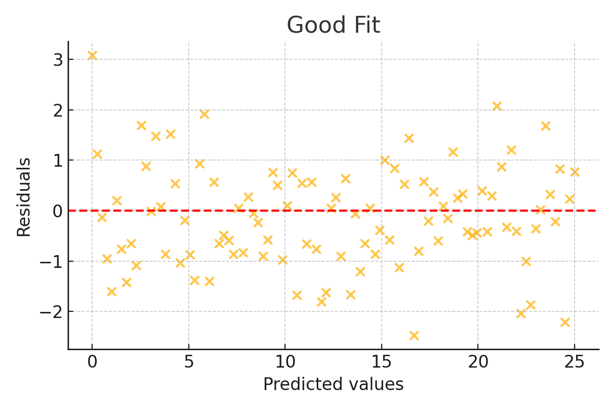
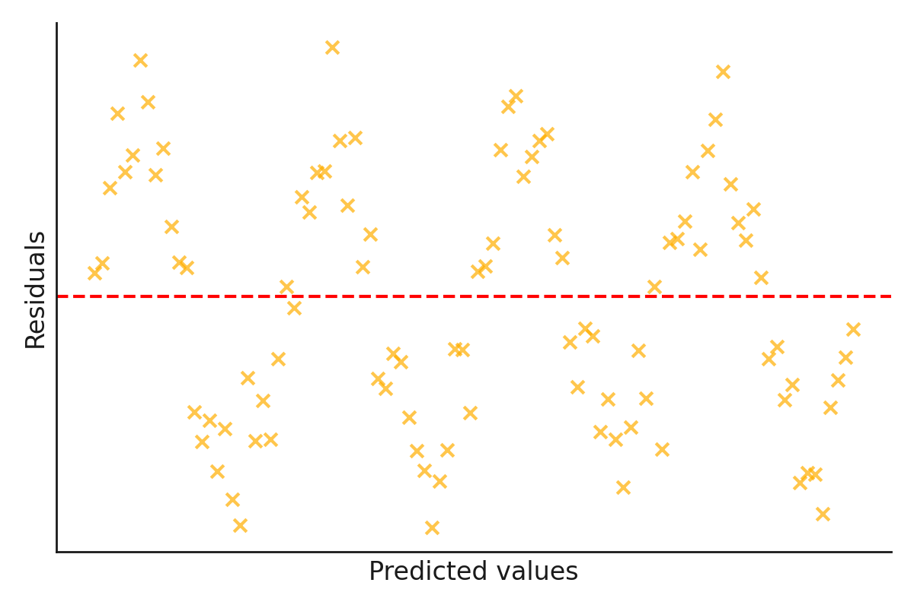
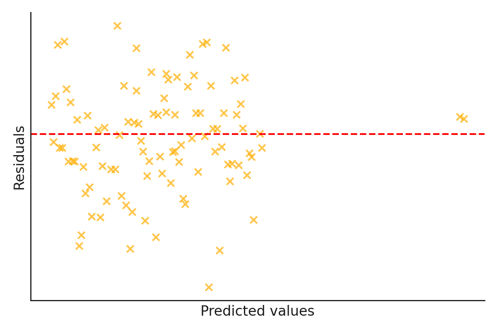
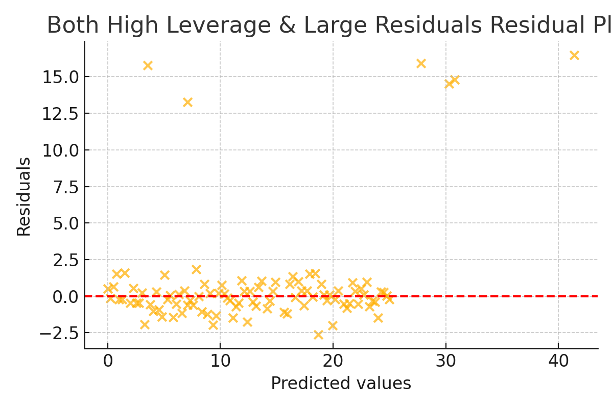
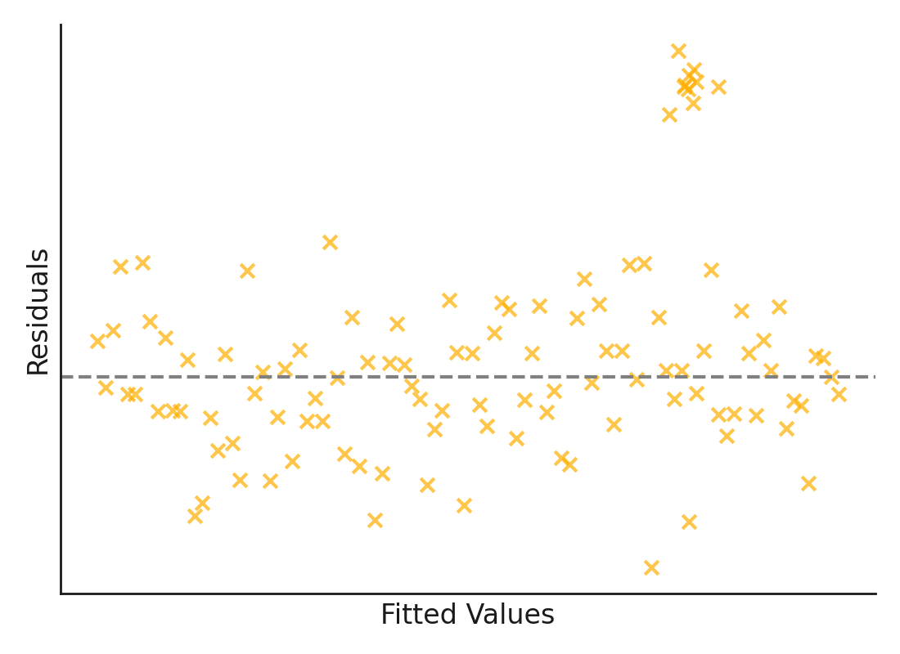
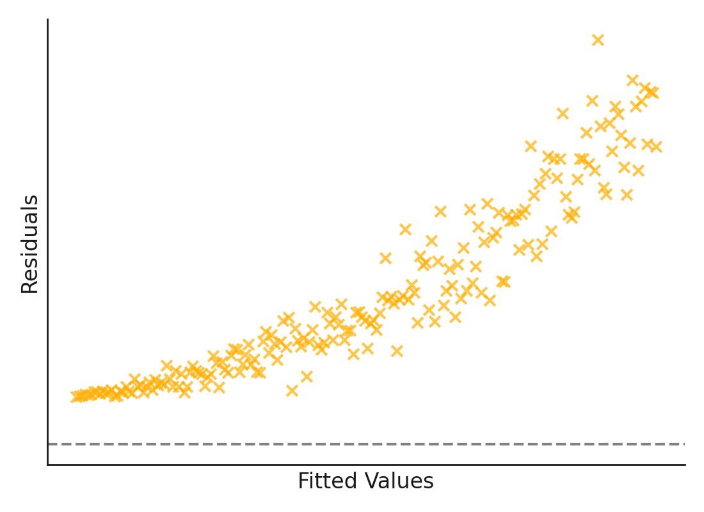

```{r setup, include=FALSE}
knitr::opts_chunk$set(error = TRUE)
knitr::knit_engines$set(python = reticulate::eng_python)

library(learnr)
library(gradethis)
library(reticulate)
library(sortable)


# Correct answers for residual plot matching
correct_answers_resid <- list(
  good = "Plot C",
  nonlinear = "Plot D",
  hetero = "Plot A",
  non_normal = "Plot B"
)

plot_labels_resid <- list(
  "Plot C" = HTML(''),
  "Plot D" = HTML(''),
  "Plot A" = HTML(''),
  "Plot B" = HTML('')
)


# Correct answers for outlier plot matching
correct_answers_outlier <- list(
  leverage = HTML(''),
  residuals = HTML(''),
  both = HTML(''),
  cluster = HTML('')
)

# Set the path to the existing Python environment
#reticulate::use_python("/opt/python/3.9.21/bin/python", required = TRUE)

# Optional: Install necessary Python packages if not already installed
# reticulate::py_install(c('numpy', 'pandas', 'plotnine'))

custom_checker <- function(label, user_code, solution_code, envir_result, evaluate_result, last_value, stage, ...) {
  if (stage == "code_check") {
      if (user_code == solution_code){
          return(list(message = random_praise(), correct = TRUE))
      }
    return(list(message = random_encouragement(), correct = FALSE))
  }
}

gradethis_setup()
tutorial_options(exercise.completion = FALSE, exercise.checker = custom_checker, exercise.timelimit = 30)
```


```{r header, echo = FALSE}
library(htmltools)

tags$div(
  class = "topContainer",
  tags$div(
    class = "logoAndTitle",
    tags$img(
      src = "./images/dsi_logo.png",
      alt = "DSI Logo",
      class = "topLogo"
    ),
    tags$h1("Assumption Checking and Multiple Linear Regression",
    class = "pageTitle")
  )
)
```

```{python empty, echo=FALSE}
# removing the internal error with an empty python chunk
```

## Goals

-   Address failed assumptions in linear regression.
-   Explore datasets with multiple variables for the purpose of multiple linear regression.
-   Find significant predictors for a response variable in multiple linear regression.

## Setup

For this lab we will be using `numpy`, `pandas`, `plotnine`, `statsmodels`, and a random sample of the AirBnB dataset you've seen in previous homework assignments. Refresh yourself on the variables the dataset includes by reading the [Kaggle documentation](https://www.kaggle.com/datasets/thedevastator/airbnb-prices-in-european-cities). 

The other thing we want to be able to do is investigate more than a few columns (for example, in a correlation matrix). We can use the `set_option()` function from `pandas` to force Python to show us all of the output. See the last line of code in the cell below for an example. 
Run the cell below to setup our environment.

```{python setup1, exercise=TRUE}
import numpy as np
import pandas as pd
import plotnine as p9
import statsmodels.api as sm

# To download this file go to https://posit.ds.uchicago.edu/data119-lab3/www/AirBnB_mini.csv

AirBnB_prices = pd.read_csv("./data/AirBnB_mini.csv") 

pd.set_option('display.max_columns', None)
```

## Reviewing SLR with `statsmodels`

1. Using `statsmodels` syntax, refit a simple linear regression model predicting `realSum` from `dist`, and make a note of the $R^2$ (which can be found in the `.summary()` output.

```{python slr, exercise = TRUE, message = FALSE, exercise.setup="setup1"}
X1 = AirBnB_prices[...]
X1 = sm.add_constant(X1)

Y = AirBnB_prices[...]

model1 = sm.OLS(Y, X1).fit()
model1.summary()
```

```{python slr-solution, message = FALSE, warning = FALSE, echo = FALSE}
X1 = AirBnB_prices["dist"]
X1 = sm.add_constant(X1)

Y = AirBnB_prices["realSum"]

model1 = sm.OLS(Y, X1).fit()
model1.summary()
```

```{r slr-code-check, message = FALSE, warning = FALSE}
grade_this_code()
```

2. You might remember that the `dir()` function can identify different objects within another object, and that in `statsmodels` objects, there are lot of useful, pre-calculated objects. Apply it to `model1`.

```{python setup1_5, exercise=FALSE, echo=FALSE, exercise.setup="setup1"}
X1 = AirBnB_prices["dist"]
X1 = sm.add_constant(X1)

Y = AirBnB_prices["realSum"]

model1 = sm.OLS(Y, X1).fit()
```

```{python dir, exercise = TRUE, message = FALSE, exercise.setup="setup1_5"}

```

```{python dir-solution, message = FALSE, warning = FALSE, echo = FALSE}
dir(model1)
```

```{r dir-code-check, message = FALSE, warning = FALSE}
grade_this_code()
```

```{r q3, echo=FALSE}
question("3. Which object do you think contains the predicted values for this model?",
         answer("`resid`", message = "`resid` gives you the residuals, which are calculated using the predicted values, but are not the same."),
         answer("`fittedvalues`", correct=TRUE, message = "Fitted values is another way of saying predicted values."),
         answer("`predict`", message = "Close! `predict` is actually a method that will predict a value using the line for a new observation."),
         answer("`pvalues`", message = "You might think `pvalues` stands for predicted values, but they're actually a totally different thing."), 
         allow_retry = TRUE, 
         random_answer_order = TRUE, 
         post_message = "Congratulations! You have found the first secret word: QUALITY.")
```

```{r q4, echo=FALSE}
question("4. Which object do you think contains the residuals for this model?",
         answer("`resid`", correct = TRUE),
         answer("`fittedvalues`", message = "We do need the predicted values to calculate the residuals, but we also need the observed values as well."),
         answer("`resid_pearson`", message = "Close! `resid_pearson` is actually a slightly different kind of residual, which you may learn more about in DATA213."),
         answer("`df_resid`", message = "You might think `df_resid` stands for DataFrame of residuals, but it is actually a different quantity called the degrees of freedom of the residuals."), 
         allow_retry = TRUE,
         random_answer_order = TRUE)
```

There are many other useful things to unpack from a `statsmodels` object, but for now, let's focus on using `fittedvalues` and `resid` to create diagnostic plots.

## Assumptions of Linear Regression

Before we create our own diagnostic plots, let's review the linear regression assumptions:

1. **Linearity** - x and y have a linear relationship
2. **Constant variance** (homoscedasticity) - the variance does not change for different values of x
3. **Symmetric, unimodal residuals** - residuals should have an approximately normal distribution
4. **Independence of predictors** (we will talk about this more in Lab 3.5)
5. **Independence of errors** (this we usually assume to be true)

:::: {.discussionbox}
::: {.center}
**Discuss with a neighbor (or on Ed):**
:::
1. What would a diagnostic plot that fits all assumptions look like?
2. What would you look for in a diagnostic plot to test for each assumption?
::::

Practice looking for these issues in diagnostic plots by answering the following questions:

```{r q5, echo = FALSE}
uiOutput("residual_bucket_ui")
actionButton("submit_resid", "Submit")
#actionButton("reset_resid", "Try Again")
verbatimTextOutput("result_resid")
```

```{r q6, echo = FALSE}
uiOutput("outlier_bucket_ui")
actionButton("submit_outlier", "Submit")
#actionButton("reset_outlier", "Try Again")
verbatimTextOutput("result_outlier")
```

```{r q7, echo = FALSE}
question_checkbox(
  HTML("
    7. Which issues are present in the residual plot shown?<br><br>
    
  "),
  answer("Non-Normal Residuals", correct = TRUE),
  answer("Large Residuals", correct = TRUE),
  answer("Heteroscedasticity"),
  answer("Non-Linearity"),
  answer("High Leverage Points"),
  message = "The residuals show a skewed distribution and several extreme values, indicating non-normality and large outliers.",
  allow_retry = TRUE,
  random_answer_order = TRUE
)
```

```{r q8, echo = FALSE}
question_checkbox(
  HTML("8. Which issues are present in this residual plot shown?<br><br>
    "),
  answer("Non-Linearity", correct = TRUE),
  answer("Heteroscedasticity", correct = TRUE),
  answer("Non-Normal Residuals"),
  answer("High Leverage Points"),
  answer("Normally Distributed Residuals"),
  message = "The residuals increase in spread and follow a curved pattern — suggesting both heteroscedasticity and non-linearity.",
  allow_retry = TRUE,
  random_answer_order = TRUE
)

```


## Diagnostic Plots

9. Edit the cell below to extract the predicted values and the residuals and turns them into a DataFrame (which we need to use for `plotnine`).

```{python setup2, exercise=FALSE, echo=FALSE, exercise.setup="setup1_5"}
X1 = AirBnB_prices["dist"]
X1 = sm.add_constant(X1)

Y = AirBnB_prices["realSum"]

model1 = sm.OLS(Y, X1).fit()

AirBnB_prices['logRealSum'] = np.log(AirBnB_prices['realSum'])
```

```{python dp_extract, exercise = TRUE, message = FALSE, exercise.setup="setup2"}
## Extracting the predicted values from the model and
## putting them in a DataFrame.
model1_df = model1.fittedvalues.to_frame(name = ___ )

## Adding a column of the residuals to the DataFrame.
model1_df[___] = model1.___
```

```{python dp_extract-solution, message = FALSE, warning = FALSE, echo = FALSE}
## Extracting the predicted values from the model and
## putting them in a DataFrame.
model1_df = model1.fittedvalues.to_frame(name = 'Fitted')

## Adding a column of the residuals to the DataFrame.
model1_df['Residuals'] = model1.resid
```

```{r dp_extract-code-check, message = FALSE, warning = FALSE}
grade_this_code()
```

10. Now, using `model1_df`, edit the cell to produce the diagnostic plots (a scatterplot of residuals against the predicted (aka fitted) values, and a histogram of the residuals).

```{python setup2_5, exercise=FALSE, echo=FALSE, exercise.setup="setup2"}
model1_df = model1.fittedvalues.to_frame(name = 'Fitted')
model1_df['Residuals'] = model1.resid
```

```{python dp_produce, exercise=TRUE, exercise.eval = FALSE, message = FALSE, exercise.setup="setup2_5"}
(p9.ggplot(model1_df, p9.aes(x = ___, y = ___)) +
 p9.geom_point() +
 p9.xlab("Predicted Price") +
 p9.ylab("Residuals"))
             
(p9.ggplot(model1_df, p9.aes(x = ___)) +
   p9.geom____(bins = 230) +
   p9.xlab("Residuals"))
```

```{python dp_produce-solution, message = FALSE, warning = FALSE, echo = FALSE}
(p9.ggplot(model1_df, p9.aes(x = 'Fitted', y = 'Residuals')) +
 p9.geom_point() +
 p9.xlab("Predicted Price") +
 p9.ylab("Residuals"))
             
(p9.ggplot(model1_df, p9.aes(x = 'Residuals')) +
   p9.geom_histogram(bins = 230) +
   p9.xlab("Residuals"))
```

```{r dp_produce-code-check, message = FALSE, warning = FALSE}
grade_this_code()
```

```{r q11, echo=FALSE}
question("11. Describe the distribution of the residuals.",
         answer("Symmetric"),
         answer("Right skewed", correct=TRUE, message="The linear regression assumption of symmetric residuals is violated."),
         answer("Left skewed", message = "The distribution is skewed, but look at the direction of the tail."), 
         allow_retry = TRUE,
         random_answer_order = TRUE,
         post_message = "Congratulations! You have found the second secret word: SEPARATE.")
```

12. Sometimes when the response variable is particularly skewed, we can easily address failed assumptions by applying a mathematical transformation to the different variables. Money-related distributions are almost always skewed, but this one is particularly bad in part due to a few very extreme values (specifically, a 1,854,545 euro per night one bedroom home in Athens). 

To address the skewness, apply the log (base $e$) transformation to `realSum`. Save the transformed values as a new column in your data frame (name it `logRealSum`). Plot the distribution of the transformed variable and re-examine the histogram.

```{python log, exercise = TRUE, message = FALSE, exercise.setup="setup2_5"}
AirBnB_prices['logRealSum'] = np.log(___)

(p9.ggplot(AirBnB_prices, p9.aes(x = ___)) +
  p9.geom_histogram(bins = 24))
```

```{python log-solution, message = FALSE, warning = FALSE, echo = FALSE}
AirBnB_prices['logRealSum'] = np.log(AirBnB_prices['realSum'])

(p9.ggplot(AirBnB_prices, p9.aes(x = 'logRealSum')) +
  p9.geom_histogram(bins = 24))
```

```{r log-code-check, message = FALSE, warning = FALSE}
grade_this_code()
```

This distribution is far less skewed! The center and spread have also changed since we are working on a new scale, but it is the shape that we are primarily concerned with. There are still a handful of extreme values, but nothing quite as bad as before.

13. Now, edit this cell to fit a new model predicting `logRealSum` from `dist`. Make a note of the $R^2$. Examine the diagnostic plots from the new model, which you should call `model2`.

```{python log_diag, exercise=TRUE, exercise.eval = FALSE, message = FALSE, exercise.setup="setup2_5"}
Y2 = AirBnB_prices["logRealSum"]

model2 = sm.OLS(___, ___).fit()
model2.summary()

model2_df = model2.fittedvalues.to_frame(name = 'Fitted')
model2_df['Residuals'] = model2.resid

(p9.ggplot(model2_df, p9.aes(x = 'Fitted', y = 'Residuals')) +
 p9.geom_point() +
 p9.xlab("log Predicted Price") +
 p9.ylab("Residuals"))
 
(p9.ggplot(model2_df, p9.aes(x = 'Residuals')) +
   p9.geom_histogram(bins = 24) +
   p9.xlab("Residuals"))
```

```{python log_diag-solution, message = FALSE, warning = FALSE, echo = FALSE}
Y2 = AirBnB_prices["logRealSum"]

model2 = sm.OLS(Y2, X1).fit()
model2.summary()

model2_df = model2.fittedvalues.to_frame(name = 'Fitted')
model2_df['Residuals'] = model2.resid

(p9.ggplot(model2_df, p9.aes(x = 'Fitted', y = 'Residuals')) +
 p9.geom_point() +
 p9.xlab("log Predicted Price") +
 p9.ylab("Residuals"))
 
(p9.ggplot(model2_df, p9.aes(x = 'Residuals')) +
   p9.geom_histogram(bins = 24) +
   p9.xlab("Residuals"))
```

```{r log_diag-code-check, message = FALSE, warning = FALSE}
grade_this_code()
```

```{r q14, echo=FALSE}
question("14. True or False: A linear model is more appropriate for these two variables than the previous variables.",
         answer("True", correct = TRUE),
         answer("False"),
         allow_retry = TRUE)
```

The $R^2$ is still very small, and the residual plot still looks somewhat patterned, although slightly less so. The biggest change is in the distribution of the residuals, which is still not entirely symmetric but is much closer to meeting the assumption.

Transforming the response variable is one common technique for addressing violated assumptions in linear regression. The log transform is probably the most frequently used, but you can also try logs with different bases, the square root or other exponents, the inverse, or double log, among others!

## Significance Testing with Simple Linear Regression

15. The $R^2$ for both models is fairly low, so we already have some idea of whether `dist` is a helpful predictor. Let's practice formally finding significant features in the model.

```{r q15, echo=FALSE}
question("Given $H_0: \\beta_{dist} = 0$, what is an appropriate alternative hypothesis?",
         answer("$H_A: \\beta_{dist} > 0$"),
         answer("$H_A: \\beta_{dist} \\neq 0$", correct = TRUE),
         answer("$H_A: \\beta_{dist} < 0$"),
         allow_retry = TRUE,
         post_message = "Congratulations! You have found the third secret word: BACKGROUND.")
```

:::: {.notebox}
::: {.center}
**Note:**
:::
Each of our hypotheses is written in terms of $\beta_{dist}$, the **parameter** NOT $b_{dist}$, the **statistic**! Recall, statistics are based on individual samples. We are wanting to make a claim about the *true* value of the coefficient for the whole population. We already know whether or not our statistic is equal to 0. We can directly calculate it.
::::

16. Print the summary output from `model2`.

```{python setup3, exercise=FALSE, echo=FALSE, exercise.setup="setup2_5"}
Y2 = AirBnB_prices["logRealSum"]

model2 = sm.OLS(Y2, X1).fit()

model2_df = model2.fittedvalues.to_frame(name = 'Fitted')
model2_df['Residuals'] = model2.resid
```

```{python m2, exercise=TRUE, message = FALSE, exercise.setup="setup3"}
model2.___
```

```{python m2-solution, message = FALSE, warning = FALSE, echo = FALSE}
model2.summary()
```

```{r m2-code-check, message = FALSE, warning = FALSE}
grade_this_code()
```

```{r q17, echo=FALSE}
question("17. Would you reject or fail to reject a formal hypothesis test investigating whether or not the coefficient is zero?",
         answer("Reject"),
         answer("Fail to reject", correct=TRUE, message = "A conclusion of this test in context would be that there is not enought evidence to say that distance is a significant predictor of log AirBnB price per night in ten major European cities."), 
         allow_retry = TRUE)
```

:::: {.notebox}
::: {.center}
**Note:**
:::
We did not provide "Accept" as an answer choice. We never accept the null hypothesis, only fail to reject it.  Failing to find strong evidence against isn’t the same as proving something. The data might just be inconclusive, noisy, or underpowered.
::::

## Multiple Linear Regression

18. `dist` may be significant, but as we can see from the adjusted $R$-squared, it doesn't predict `logRealSum` very well. Let's try adding more variables! Run this cell to take a look at `AirBnB_prices` and use it to answer the following question--again, check out the [Kaggle documentation](https://www.kaggle.com/datasets/thedevastator/airbnb-prices-in-european-cities) if you need.

```{python col, exercise=TRUE, exercise.eval = FALSE, message = FALSE, exercise.setup="setup3"}
AirBnB_prices.columns
```

```{r q18, echo=FALSE}
question_checkbox("Some variables are likely collinear--can you identify any pairs that might give you trouble later on? Select ALL that apply.",
         answer("`attr_index` and `attr_index_norm`", correct = TRUE),
         answer("`rest_index` and `rest_index_norm`", correct = TRUE),
         answer("`person_capacity` and `bedrooms`", correct = TRUE),
         answer("`cleanliness_rating` and `guest_satisfaction_overall`", correct = TRUE),
         answer("`dist` and `metro_dist`"),
         answer("`lng` and `lat`"),
         allow_retry = TRUE,
         random_answer_order = TRUE)
```

19. To confirm assumptions, edit the code so that it will calculate the correlation matrix for the numeric variables (we can ignore indicators for Lab 3). For easier reading, I've rounded to three decimals. 

```{python cormat, exercise=TRUE, exercise.eval = FALSE, message = FALSE, exercise.setup="setup3"}
round(AirBnB_prices[[ ___ ]].corr(), 3)
```

```{python cormat-solution, message = FALSE, warning = FALSE, echo = FALSE}
round(AirBnB_prices[['logRealSum', 'person_capacity', 'cleanliness_rating', 'guest_satisfaction_overall', 'bedrooms', 'dist', 'metro_dist', 'attr_index', 'attr_index_norm', 'rest_index', 'rest_index_norm', 'lng', 'lat']].corr(), 3)
```

```{r cormat-code-check, message = FALSE, warning = FALSE}
grade_this_code()
```

Take a closer look at the correlation matrix--are the results consistent with your answer to question 16? You may have located even more problematic pairings (anything over 0.8 is concerning), but based on the documentation, you should have found that `attr_index` and `attr_index_norm`, as well as `rest_index` and `rest_index_norm`, are just normalized versions of each other. To avoid collinearity issues, we should only include one version of each. 

We are not covering multicollinearity (AKA the 4th assumption in our earlier list) in this lab (instead, see Lab 3.5), but it is important to know that you can address it by considering the context of your variables before you even select the model! So, be careful with your data dictionaries and pay attention to the variables that you are working with. 

20. Now let's try multiple linear regression. Run the cell below to fit a model predicting `realSum` with the numeric variables--be careful to use only one set of the `attr` and `rest` variables.

```{python setup4, exercise=TRUE, exercise.eval = FALSE, message = FALSE, exercise.setup="setup3"}
X3 = AirBnB_prices[['person_capacity', 'cleanliness_rating', 'guest_satisfaction_overall', 'bedrooms', 'dist', 'metro_dist', 'attr_index_norm', 'rest_index_norm', 'lng', 'lat']]
X3 = sm.add_constant(X3)

model3 = sm.OLS(Y, X3).fit()
model3.summary()
```

```{r q20, echo=FALSE}
question_numeric(
  "What is the adjusted $R^2$? Round to 3 decimal places",
  answer_fn(function(value) {
    if (value == 0.141) {
      incorrect("That is the $R^2$! Don't forget to look for the adjusted $R^2$.")
    } else if (value == 0.125) {
      correct("Great job!")
    }
    else {
      incorrect("Not quite, try again! Remember your answer should be as a decimal, not a percent, and have 3 decimal places.")
    }
  }),
  step = 0.001,
  allow_retry = TRUE
)
```

21. Run this cell to look at the diagnostic plots of this model.

```{python diagplots, exercise=TRUE, exercise.eval = FALSE, message = FALSE, exercise.setup="setup4"}
model3_df = model3.fittedvalues.to_frame(name = 'Fitted')
model3_df['Residuals'] = model3.resid

(p9.ggplot(model3_df, p9.aes(x = 'Fitted', y = 'Residuals')) +
 p9.geom_point() +
 p9.xlab("Predicted Price") +
 p9.ylab("Residuals"))

(p9.ggplot(model3_df, p9.aes(x = 'Residuals')) +
   p9.geom_histogram(bins = 24) +
   p9.xlab("Residuals"))
```

```{r q22, echo=FALSE}
question("22. True or False: The linear model is appropriate for this dataset.",
         answer("True"),
         answer("False", correct = TRUE),
         allow_retry = TRUE)
```

23.  Don't forget that the transformed response had much better diagnostic plots for the simple linear regression! Run the cell below to predict `logRealSum`.

```{python setup5, exercise=TRUE, exercise.eval = FALSE, message = FALSE, exercise.setup="setup4"}
model4 = sm.OLS(Y2, X3).fit()
model4.summary()
```

```{r q23, echo=FALSE}
question_numeric(
  "What is the adjusted $R^2$? Round to 3 decimal places",
  answer_fn(function(value) {
    if (value == 0.443) {
      correct("Great job!")
    }
    else {
      incorrect("Not quite, try again! Remember your answer should be as a decimal, not a percent, and have 3 decimal places.")
    }
  }),
  step = 0.001,
  allow_retry = TRUE
)
```

24. Redo the diagnostic plots (use the code above as a reference if you need!).

```{python diagnostic_plots_log, exercise=TRUE, message = FALSE, exercise.setup="setup5"}

```

```{python diagnostic_plots_log-solution, message = FALSE, warning = FALSE, echo = FALSE}
model4_df = model4.fittedvalues.to_frame(name = 'Fitted')
model4_df['Residuals'] = model4.resid

(p9.ggplot(model4_df, p9.aes(x = 'Fitted', y = 'Residuals')) +
 p9.geom_point() +
 p9.xlab("Predicted Price") +
 p9.ylab("Residuals"))

(p9.ggplot(model4_df, p9.aes(x = 'Residuals')) +
   p9.geom_histogram(bins = 24) +
   p9.xlab("Residuals"))
```

```{r diagnostic_plots_log-code-check, message = FALSE, warning = FALSE}
grade_this_code()
```

```{r q25, echo=FALSE}
question("25. True or False: A linear model is more appropriate for this data set.",
         answer("True", correct = TRUE),
         answer("False"),
         allow_retry = TRUE,
         post_message = "Congratulations! You have found the fourth secret word: SAMPLE.")
```

:::: {.notebox}
::: {.center}
**Note:**
:::
In the summary there was a warning about a large condition number. This warning has to do with multicollinearity, and tells us that we need to eliminate some of the variables. For more on multicollinearity, check out Lab 3.5.
::::

## Significance Testing with Multiple Linear Regression

Use the summary of the multiple linear regression model to answer the following questions. 

```{python mlrsummary, exercise=TRUE, exercise.eval = FALSE, message = FALSE, exercise.setup="setup5"}
model4.summary()
```

```{r q26, echo=FALSE}
question_checkbox("26. Which of the variables are significant at the 5% level? Select ALL that apply.",
         answer("`const`", correct = TRUE),
         answer("`person_capacity`", correct = TRUE),
         answer("`cleanliness_rating`"),
         answer("`guest_satisfaction_overall`"),
         answer("`bedrooms`", correct = TRUE),
         answer("`dist`", correct = TRUE),
         answer("`metro_dist`"),
         answer("`attr_index_norm`", correct = TRUE),
         answer("`rest_index_norm `"),
         answer("`lng`", correct = TRUE),
         answer("`lat`", correct = TRUE),
         allow_retry = TRUE,
         post_message = "Congratulations! You have found the fifth and final secret word: SHAPE.")
```

```{r q27, echo=FALSE}
question("27. For every one bedroom increase, log price is expected to  ",
         answer("increase by 0.4324.", correct = TRUE),
         answer("decrease by 0.4324.", message = "Be careful of the sign!"),
         answer("increase by 0.058.", message = "That's the standard error!"),
         answer("decrease by 0.058."),
         allow_retry = TRUE,
         random_answer_order = TRUE)
```

```{r serverstuff, echo = FALSE, context = "server"}
# UI for residual matching
output$residual_bucket_ui <- renderUI({
  bucket_list(
    header = "Drag each residual plot to the issue it illustrates:",
    group_name = "residuals",
    orientation = "vertical",
    add_rank_list(
      text = "Plots:",
      labels = plot_labels_resid,
      input_id = "unsorted_resid"
    ),
    add_rank_list("Good Fit (no violations)", labels = NULL, input_id = "good"),
    add_rank_list("Non-Linearity", labels = NULL, input_id = "nonlinear"),
    add_rank_list("Heteroscedasticity", labels = NULL, input_id = "hetero"),
    add_rank_list("Non-Normal Residuals", labels = NULL, input_id = "non_normal")
  )
})

observeEvent(input$submit_resid, {
  # Default to empty list if any input is NULL
  inputs <- list(
    good = input$good %||% character(0),
    nonlinear = input$nonlinear %||% character(0),
    hetero = input$hetero %||% character(0),
    non_normal = input$non_normal %||% character(0)
  )

  # Check whether each bucket has the expected plot label as the first item
  result <- all(
    length(inputs$good) == 1 && inputs$good[1] == correct_answers_resid$good,
    length(inputs$nonlinear) == 1 && inputs$nonlinear[1] == correct_answers_resid$nonlinear,
    length(inputs$hetero) == 1 && inputs$hetero[1] == correct_answers_resid$hetero,
    length(inputs$non_normal) == 1 && inputs$non_normal[1] == correct_answers_resid$non_normal
  )

  output$result_resid <- renderText({
    if (result) {
      "✅ Correct! Well done."
    } else {
      "❌ Some matches are incorrect. Try again!"
    }
  })
})


# UI for outlier matching
output$outlier_bucket_ui <- renderUI({
  bucket_list(
    header = "6. Drag each residual plot to the type of outlier it shows:",
    group_name = "outliers",
    orientation = "horizontal",
    add_rank_list(
      text = "Plots:",
      labels = unname(correct_answers_outlier),
      input_id = "unsorted_outlier"
    ),
    add_rank_list("High Leverage Points", labels = NULL, input_id = "leverage"),
    add_rank_list("Large Residuals", labels = NULL, input_id = "residuals"),
    add_rank_list("High Leverage + Large Residuals", labels = NULL, input_id = "both"),
    add_rank_list("Clustered Outliers", labels = NULL, input_id = "cluster")
  )
})

observeEvent(input$submit_outlier, {
  result <- all(
    identical(input$leverage, list(correct_answers_outlier$leverage)),
    identical(input$residuals, list(correct_answers_outlier$residuals)),
    identical(input$both, list(correct_answers_outlier$both)),
    identical(input$cluster, list(correct_answers_outlier$cluster))
  )
  output$result_outlier <- renderText({
    if (result) "✅ Correct! Well done."
    else "❌ Some matches are incorrect. Try again!"
  })
})

# observeEvent(input$reset_resid, {
#   updateRankListInput(session, "unsorted_resid", labels = unname(correct_answers_resid))
#   updateRankListInput(session, "good", labels = NULL)
#   updateRankListInput(session, "nonlinear", labels = NULL)
#   updateRankListInput(session, "hetero", labels = NULL)
#   updateRankListInput(session, "non_normal", labels = NULL)
#   output$result_resid <- renderText({ "" })  # Clear feedback
# })

# observeEvent(input$reset_outlier, {
#   updateRankListInput(session, "unsorted_outlier", labels = unname(correct_answers_outlier))
#   updateRankListInput(session, "leverage", labels = NULL)
#   updateRankListInput(session, "residuals", labels = NULL)
#   updateRankListInput(session, "both", labels = NULL)
#   updateRankListInput(session, "cluster", labels = NULL)
#   output$result_outlier <- renderText({ "" })
# })

```

