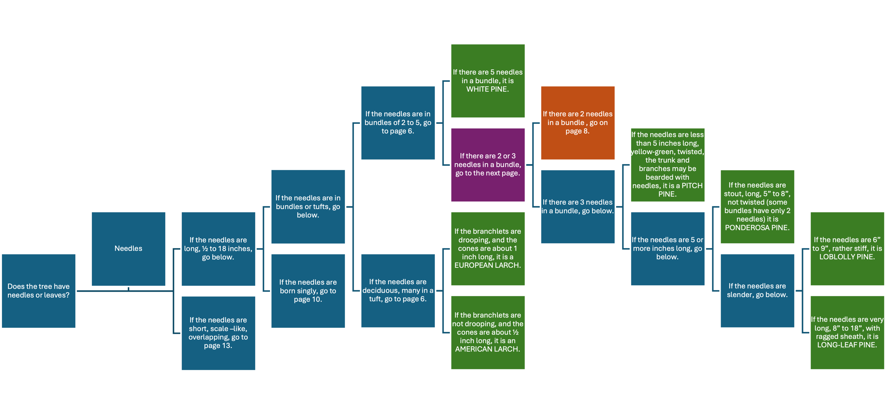
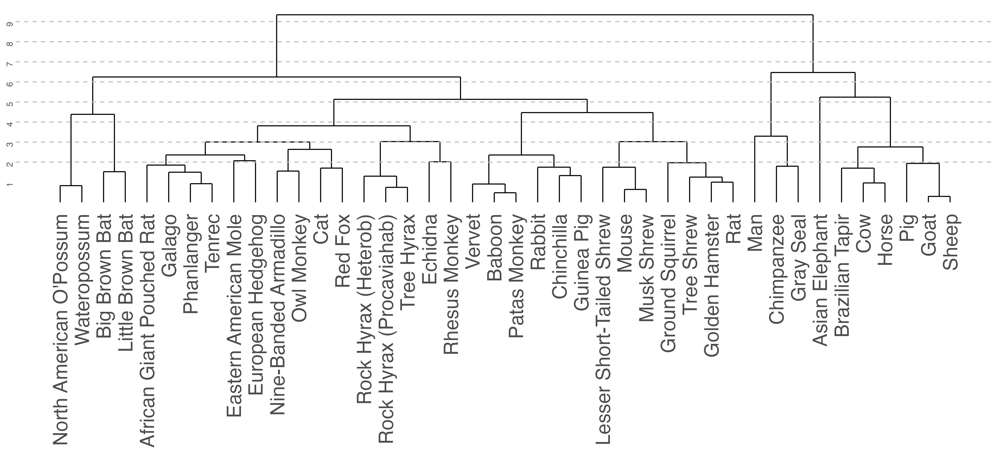

```{r setup, include=FALSE}
knitr::opts_chunk$set(error = TRUE)
#knitr::knit_engines$set(python = reticulate::eng_python)

## Package Requirements for Lab

library(gradethis)
library(learnr)
library(tidyverse)

## Package Requirements  for Content

## Requirements for Answer Checking

custom_checker <- function(label, user_code, solution_code, envir_result, evaluate_result, last_value, stage, ...) {
  if (stage == "code_check") {
      if (user_code == solution_code){
          return(list(message = random_praise(), correct = TRUE))
      }
    return(list(message = random_encouragement(), correct = FALSE))
  }
}

gradethis_setup()
tutorial_options(exercise.completion = FALSE, exercise.checker = custom_checker)
```

```{r header, echo = FALSE}
library(htmltools)

tags$div(
  class = "topContainer",
  tags$div(
    class = "logoAndTitle",
    tags$img(
      src = "./images/dsi_logo.png",
      alt = "DSI Logo",
      class = "topLogo"
    ),
    tags$h1("Trees", class = "pageTitle")
  )
)
```

```{python setup_py, context="setup", echo = FALSE, message = FALSE, warning = FALSE}
class Tree:
  ## Every method in a tree takes itself. 
  def __init__(self, name, value): 
    self.name = name
    self.value = value
    self.children = []
  def add_child(self, child):
    self.children.append(child)
    
pit = Tree("Pittsburgh", 0.3)
phl = Tree("Philadelphia", 1.6)
pa = Tree("Pennsylvania", 0)

pa.add_child(pit)
pa.add_child(phl)

chi = Tree("Chicago", 2.7)
il = Tree("Illinois", 0)

il.add_child(chi)

us = Tree("United States", 0)

```

## Goals

The goal of this lab is to become familiar with the trees, both as a new kind of data structure as well as a class. 

## What is a tree?

Let's first consider the idea of a tree as a data structure.  Every time you've learned a new data structure, it's made it either possible or more pleasant to do certain things that you otherwise couldn't or really wouldn't want to do with the old data structures.

For example, it's hard to imagine coding anything in Python without lists. Or, as data scientists, it's hard to imagine carrying out a data analysis or machine learning task without a `pandas` DataFrame, as they're ideal for working with tabular data. 
  
So far, the data types we have learned about are one-dimensional. Consider something actively two-dimensional--hierarchies in general. It is more effective for us to have something tailor-made for hierarchies--enter trees.

## Examples of Trees

We will get to a more formal definition of trees later, but for now, let's consider some real-life examples. First, consider *taxonomic ranks*, which you may have heard of in biology class. Taxonomic rank describes a hierarchy in biology--every living thing can be divided first into domains, then kingdoms, then phylums, classes, orders, families, genuses, and species. You can see that this structure is naturally hierarchical. Class *Mammalia* (mammals) can be broken down into several orders, *Primates* being one of them, and then the orders can be broken down into several families, families into genuses, and genuses into species. For example, humans are classified as species *homo sapiens*, genus *homo*, family *Hominidae*, order *Primate*, class *Mammalia*, phylum *Chordata*, and kingdom *Animalia*. A list or something one dimensional cannot necessarily organize this structure nicely, but a tree can. 

Other trees that you might be more familiar with from a data science context are decision trees. Decision trees can be hardcoded--consider the following tree, built using *Tree Finder, A Manual for the Identification of Trees by Their Leaves*, originally published in 1963. 

{width=99%}

When traversing this tree, you have to first decide if a tree has needles or leaves, then you must examine the length of the needles, then you must count how many needles in a bunch, etc. This tree is hierarchical, each decision you make depends on your previous decision. Decision trees for classification and regression work in the same way--they have just been made with training data. 

Another tree that you are hopefully familiar with is a dendrogram, used to visualize clusters created via Hierarchical or Agglomerative clustering. Consider the following dendrogram, creating clusters of various mammals based on different characteristics and physical measurements.

{width=99%}

Again, we can see that this is by nature hierarchical. The clusters are broken down into successively smaller groups, until each observation is on its own. These are only a few examples of trees, but hopefully you can see that they fulfill a need when discussing hierarchically structured data. 

## Tree Vocabulary

Here is some vocabulary you will need to know to discuss trees:

* A "spot" in the tree is called a *node*.
  + Nodes that are directly above other nodes are called *parent nodes*.
  + Correspondingly, nodes that are directly below other nodes are called *child nodes*.
  + You can generalize this--any node above another node is an *ancestor*, any node below another node is a *descendant*.
  + You sometimes see grandparent, grandchild, in that vein we can also use *siblings* (nodes on the same level).
* The only node that doesn't have any parents/ancestors is called a *root*.
* Nodes that do not have any children are called *leaves* (leaf).

Consider again the decision tree discussed in the previous section:

{width=99%}

```{r mc_node, echo=FALSE}
question(
  "Which of the following is a node? Select all that apply.",
  answer("Does the tree have needles or leaves?", correct = TRUE),
  answer("If the needles are in bundles or tufts, go below.", correct = TRUE),
  answer("If there are 5 needles in a bundle, it is WHITE PINE.", correct = TRUE),
  answer("If there are 2 needles in a bundle, go on page 8.", correct = TRUE),
  answer("If the needles are 6 inches to 9 inches, rather stiff, it is LOBLOLLY PINE.", correct = TRUE),
  allow_retry = TRUE, 
  message = "Correct! These are ALL nodes."
)
```

```{r mc_childnode, echo=FALSE}
question(
  "Which of the following is a child node? Select all that apply.",
  answer("Does the tree have needles or leaves?"),
  answer("If the needles are in bundles or tufts, go below.", correct = TRUE),
  answer("If there are 5 needles in a bundle, it is WHITE PINE.", correct = TRUE),
  answer("If there are 2 needles in a bundle, go on page 8.", correct = TRUE),
  answer("If the needles are 6 inches to 9 inches, rather stiff, it is LOBLOLLY PINE.", correct = TRUE),
  allow_retry = TRUE,
  post_message = "Congratulations! You have found the first secret word: AQUARIUM."
)
```

```{r mc_descendant, echo=FALSE}
question(
  "Which of the following is a descendant of 'If there are 2 or 3 needles in a bundle, go to the next page.'? Select all that apply.",
  answer("Does the tree have needles or leaves?"),
  answer("If the needles are in bundles or tufts, go below."),
  answer("If there are 5 needles in a bundle, it is WHITE PINE."),
  answer("If the branchlets are not drooping, and the cones are about $1/2$ inch long, it is an AMERICAN LARCH.", correct = TRUE),
  answer("If the needles are 6 inches to 9 inches, rather stiff, it is LOBLOLLY PINE.", correct = TRUE),
  allow_retry = TRUE
)
```

```{r mc_sibling, echo=FALSE}
question(
  "Which of the following nodes are siblings? Select all that apply.",
  answer("Does the tree have needles or leaves?"),
  answer("If there are 2 or 3 needles in a bundle, go to the next page.", correct = TRUE),
  answer("If there are 5 needles in a bundle, it is WHITE PINE.", correct = TRUE),
  answer("If the branchlets are not drooping, and the cones are about $1/2$ inch long, it is an AMERICAN LARCH."),
  answer("If the needles are 6 inches to 9 inches, rather stiff, it is LOBLOLLY PINE."),
  allow_retry = TRUE
)
```

```{r mc_root, echo=FALSE}
question(
  "Which of the following nodes is the root? Select all that apply.",
  answer("Does the tree have needles or leaves?", correct = TRUE),
  answer("If there are 2 or 3 needles in a bundle, go to the next page."),
  answer("If there are 5 needles in a bundle, it is WHITE PINE."),
  answer("If the branchlets are not drooping, and the cones are about $1/2$ inch long, it is an AMERICAN LARCH."),
  answer("If the needles are 6 inches to 9 inches, rather stiff, it is LOBLOLLY PINE."),
  allow_retry = TRUE
)
```

```{r mc_leaf, echo=FALSE}
question(
  "Which of the following nodes is a leaf? Select all that apply.",
  answer("Does the tree have needles or leaves?"),
  answer("If there are 2 or 3 needles in a bundle, go to the next page."),
  answer("If there are 5 needles in a bundle, it is WHITE PINE.", correct = TRUE),
  answer("If the branchlets are not drooping, and the cones are about $1/2$ inch long, it is an AMERICAN LARCH.", correct = TRUE),
  answer("If the needles are 6 inches to 9 inches, rather stiff, it is LOBLOLLY PINE.", correct = TRUE),
  allow_retry = TRUE,
  post_message = "Congratulations! You have found the second secret word: POT."
)
```

## Trees and Recursion

Now that you've learned some of the vocabulary, we can more formally define trees as *a recursively-defined data structure consisting of nodes connected by edges*. We haven't talked formally about recursion yet, but almost everything we do with trees will be related to recursion, including the functions we use with trees and how the trees are built themselves--we could "prune" a tree, and it would still be a tree. Like a recursive algorithm, we have a base case and a recursive case. The base case is when we encounter a leaf, a.k.a., a node with 0 subtrees, and the recursive case, a node that has other trees as subtrees.
    
## `Tree` Class

There is no built-in `Tree` class in Python, but we can write a class ourself. Assume that the constructor takes a name, `name` and a value, `value`. 

What code would you write to save `name` as an attribute of the tree? Ignore the fact that you would need to define the class, you can just write a single line of code. 

```{python name, exercise = TRUE}
        ...name = ...
```

```{python name-solution, message = FALSE, warning = FALSE, echo = FALSE}
        self.name = name
```

```{r name-code-check, message = FALSE, warning = FALSE}
grade_this_code()
```

What code would you write to save `value` as an attribute of the tree? Ignore the fact that you would need to define the class, you can just write a single line of code. 

```{python value, exercise = TRUE}
        ... = ...
```

```{python value-solution, message = FALSE, warning = FALSE, echo = FALSE}
        self.value = value
```

```{r value-code-check, message = FALSE, warning = FALSE}
grade_this_code()
```

Now let's add an attribute to the tree--`children`. We can add as many children as we want, so we should pick a data type that we can change easily.

```{r mc_mutable, echo=FALSE}
question(
  "Which of the following data types are mutable? Select all that apply.",
  answer("Integers"),
  answer("Floats"),
  answer("Strings"),
  answer("Lists", correct = TRUE),
  answer("Dictionaries", correct = TRUE),
  answer("Tuples"),
  answer("Sets", correct = TRUE),
  allow_retry = TRUE,
  post_message = "Congratulations! You have found the third secret word: SEA."
)
```

There is no reason to use a set here--we don't know if we will want to save duplicate information. We might be tempted to use a dictionary, but remember that the "children" will be trees themselves, so we don't need a key/value pair to save `name` and `value`. A list is mutable, and therefore flexible, and will store duplicate information without adding structure--so let's use one to create the `children` attribute. 

What code would you write to save `children` as an attribute of the tree? Ignore the fact that you would need to define the class, you can just write a single line of code. 

```{python children, exercise = TRUE}
        ...
```

```{python children-solution, message = FALSE, warning = FALSE, echo = FALSE}
        self.children = []
```

```{r children-code-check, message = FALSE, warning = FALSE}
grade_this_code()
```

Now let's start creating methods. Specifically, if we want to add child nodes to our tree, we need to be able to do so. 

What code would you write to define a method, `add_child`, to add a child tree to your existing tree? Your code should have two arguments and take advantage of list methods. Ignore the fact that you would need to define the class, you can just write a few lines of code. 

```{python add_child, exercise = TRUE}
    def add_child(...):
        ...
```

```{python add_child-solution, message = FALSE, warning = FALSE, echo = FALSE}
    def add_child(self, child):
        self.children.append(child)
```

```{r add_child-code-check, message = FALSE, warning = FALSE}
grade_this_code()
```

Now, take all the code you have written and add whatever you need to make it a proper class, `Tree`. 

```{python TreeClass, exercise = TRUE}


```

```{python TreeClass-solution, message = FALSE, warning = FALSE, echo = FALSE}
class Tree:
    def __init__(self, name, value): 
        self.name = name
        self.value = value
        self.children = []
    def add_child(self, child):
        self.children.append(child)
```

```{r TreeClass-code-check, message = FALSE, warning = FALSE}
grade_this_code()
```

## Example `Tree`

Now, consider an example tree where the `name` corresponds to the name of a location (either a city or state), and the `value` corresponds to the population of the city, in millions. For now, the population of the states have been set to zero. 

```{python TreeExample, exercise = TRUE}
pit = Tree("Pittsburgh", 0.3)
phl = Tree("Philadelphia", 1.6)
pa = Tree("Pennsylvania", 0)

pa.add_child(pit)
pa.add_child(phl)

chi = Tree("Chicago", 2.7)
il = Tree("Illinois", 0)

il.add_child(chi)
```

:::: {.discussionbox}
::: {.center}
**Discuss with a neighbor (or on Ed):**
:::

On some scratch paper, draw the trees that we created in the above chunk of code.

::::

Now, adapt the code below to create a `us` tree representing the United States. Give this tree a population of 0. 

```{python usTree, exercise = TRUE}
us = 
```

```{python usTree-solution, message = FALSE, warning = FALSE, echo = FALSE}
us = Tree("United States", 0)
```

```{r usTree-code-check, message = FALSE, warning = FALSE}
grade_this_code()
```

Next, add `il` and `pa` to `us`.

```{python usTree2, exercise = TRUE}

```

```{python usTree2-solution, message = FALSE, warning = FALSE, echo = FALSE}
us.add_child(il)
us.add_child(pa)
```

```{r usTree2-code-check, message = FALSE, warning = FALSE}
grade_this_code()
```

```{r mc_output1, echo=FALSE}
question(
  "What will the output of `us.children[0]` be?",
  answer("`il`"),
  answer("`pa`"),
  answer("`chi`"),
  answer("`phl`"),
  answer("`pit`"),
  answer("`[]`"),
  answer("Another tree object.", correct = TRUE),
  allow_retry = TRUE
)
```

```{r mc_output2, echo=FALSE}
question(
  "What will the output of `us.children[0].children[0]` be?",
  answer("`il`"),
  answer("`pa`"),
  answer("`chi`"),
  answer("`phl`"),
  answer("`pit`"),
  answer("`[]`"),
  answer("Another tree object.", correct = TRUE),
  allow_retry = TRUE
)
```

As you can see, trees often contain more trees--that's what make them recursive.

```{r mc_output3, echo=FALSE}
question(
  "What will the output of `us.children[0].children[0].children` be?",
  answer("`il`"),
  answer("`pa`"),
  answer("`chi`"),
  answer("`phl`"),
  answer("`pit`"),
  answer("`[]`", correct = TRUE),
  answer("Another tree object."),
  message = "Correct! We haven't added any children yet, so we are left with the empty list.",
  allow_retry = TRUE,
  post_message = "Congratulations! You have found the fourth secret word: PERFORATE"
)
```

## Recursive `Tree` Methods

You will need to know more about recursion to complete the following problems, so you can either wait until the Recursion lecture or experiment with the solutions before the lecture. 

We might be interested in calculating the number of nodes.

```{r mc_basecase1, echo = FALSE}
question(
  "What is the base case in this scenario? Consider how you might be able to tell if a tree is as small as possible.",
  answer("`children in []`"),
  answer("`children == 0`"),
  answer("`self.children == 0`"),
  answer("`len(self.children) == 0`", correct = TRUE),
  allow_retry = TRUE
)
```

```{r mc_basecase2, echo = FALSE}
question(
  "Now, what is the size of the smallest possible tree?",
  answer("0 nodes"),
  answer("1 nodes", correct = TRUE),
  answer("2 or more nodes"),
  answer("Something else"),
  allow_retry = TRUE
)
```

Now, write a conditional statement comparing the answers to your previous two questions. Your conditional should let your method know that you are in the basecase and return the appropriate value--don't worry about defining the method first.  

```{python num_nodes1, exercise = TRUE}
        if ...
            return ...
```

```{python num_nodes1-solution, message = FALSE, warning = FALSE, echo = FALSE}
        if len(self.children) == 0:
            return 1
```

```{r num_nodes1-code-check, message = FALSE, warning = FALSE}
grade_this_code()
```

Now, write code that will count the number of nodes in a larger tree. 

```{python num_nodes2, exercise = TRUE}

```

```{r num_nodes2-hint-1, echo=FALSE}
"Hint 1: How many nodes will a single node have? Initialize a variable named `rv` that uses this quantity. "
```

```{r num_nodes2-hint-2, echo=FALSE}
"Hint 2: Aside from itself, how many children does a single node have? Count these nodes and add them to `rv`. "
```

```{r num_nodes2-hint-3, echo=FALSE}
"Hint 3: We often combine recursion and iteration. You may want to use a loop to help count the child nodes."
```

```{r num_nodes2-hint-4, echo=FALSE}
"Hint 4: Don't forget, the recursive case often calls itself!"
```

```{r num_nodes2-hint-5, echo=FALSE}
"Hint 5: Make sure to add one to `rv` every time you examine a child node!"
```

```{python num_nodes2-solution, message = FALSE, warning = FALSE, echo = FALSE}
        rv = 1
        for child in self.children:
            rv += child.num_nodes()
```

```{r num_nodes2-code-check, message = FALSE, warning = FALSE}
grade_this_code()
```

Now, combine the base case and the recursive case into a single `num_nodes` method.

```{python num_nodes3, exercise = TRUE}
    def num_nodes(self):
        ## Base Case
        
            
  
        ## Recursive Case
        
        
            
        
```

```{python num_nodes3-solution, message = FALSE, warning = FALSE, echo = FALSE}
    def num_nodes(self):
        ## Base Case
        if len(self.children) == 0:
            return 1
  
        ## Recursive Case
        rv = 1
        for child in self.children:
            rv += child.num_nodes()
        return rv
```

```{r num_nodes3-code-check, message = FALSE, warning = FALSE}
grade_this_code()
```

We might also be interested in calculating the number of cities. Let's assume that cities do not have child nodes. 

```{r mc_numcities1, echo = FALSE}
question(
  "If cities do not have child nodes, what kind of nodes are they?",
  answer("Child Nodes", correct = TRUE),
  answer("Parent Nodes"),
  answer("Descendant Nodes", correct = TRUE),
  answer("Ancestor Nodes"),
  answer("Roots"),
  answer("Leaves", correct = TRUE),
  message = "Child nodes and descendant nodes are technically correct, but the most specific answer here is a leaf.",
  allow_retry = TRUE,
  post_message = "Congratulations! You have found the fifth and final secret word: PLACE."
)
```

Now, set up the base case for counting the number of cities. Don't worry about defining the method first.

```{python num_cities1, exercise = TRUE}
        if ...
```

```{python num_cities1-solution, message = FALSE, warning = FALSE, echo = FALSE}
        if len(self.children) == 0:
            return 1
```

```{r num_cities1-code-check, message = FALSE, warning = FALSE}
grade_this_code()
```

Did you get the exact same answer as the previous method? If so, that's correct! The recursive case is where the logic starts to differ. Work on some code that will set up the recursive case:

Now, write code that will count the number of nodes in a larger tree. 

```{python num_cities2, exercise = TRUE}

```

```{r num_cities2-hint-1, echo=FALSE}
"Hint 1: What is the minimum number of *children* a single, non-leaf node will have? Initialize a variable named `rv` that uses this quantity. "
```

```{r num_cities2-hint-2, echo=FALSE}
"Hint 2: How many children does the single node actually have? Count these nodes and add them to `rv`. "
```

```{r num_cities2-hint-3, echo=FALSE}
"Hint 3: We often combine recursion and iteration. You may want to use a loop to help count the child nodes."
```

```{r num_cities2-hint-4, echo=FALSE}
"Hint 4: Don't forget, the recursive case often calls itself!"
```

```{r num_cities2-hint-5, echo=FALSE}
"Hint 5: Make sure to add one to `rv` every time you examine a child node!"
```

```{python num_cities2-solution, message = FALSE, warning = FALSE, echo = FALSE}
        rv = 0
        for child in self.children:
            rv += child.num_cities()
```

```{r num_cities2-code-check, message = FALSE, warning = FALSE}
grade_this_code()
```

Now, combine the base case and the recursive case into a single `num_cities` method.

```{python num_cities3, exercise = TRUE}

```

```{python num_cities3-solution, message = FALSE, warning = FALSE, echo = FALSE}
    def num_cities(self):
        ## Base Case
        if len(self.children) == 0:
            return 1
  
        ## Recursive Case
        rv = 0
        for child in self.children:
            rv += child.num_cities()
        return rv
```

```{r num_cities3-code-check, message = FALSE, warning = FALSE}
grade_this_code()
```

Finally, we might be interested in finding the population of each tree. Remember that we set the population of countries and states to be 0--this is so we aren't double counting the population. The values should entirely depend on the populations of the leaves representing cities. Let's write a method to replace those zeroes with the total population of the child nodes.

Set up the base case for counting the population. You should be using the attributes of the trees to find this value. Don't worry about defining the method first.

```{python tree_sum1, exercise = TRUE}
        
        
        
```

```{python tree_sum1-solution, message = FALSE, warning = FALSE, echo = FALSE}
        if len(tree.children) == 0:
            return tree.value
```

```{r tree_sum1-code-check, message = FALSE, warning = FALSE}
grade_this_code()
```

Now, write code that will traverse the tree, adding to the population every time it encounters a leaf.

```{python tree_sum2, exercise = TRUE}

```

```{r tree_sum2-hint-1, echo=FALSE}
"Hint 1: What is the minimum population a single, non-leaf node will have? Initialize a variable named `rv` that uses this quantity. "
```

```{r tree_sum2-hint-2, echo=FALSE}
"Hint 2: How many children does the single node actually have? Count these nodes and add them to `rv`. "
```

```{r tree_sum2-hint-3, echo=FALSE}
"Hint 3: We often combine recursion and iteration. You may want to use a loop to help count the child nodes."
```

```{r tree_sum2-hint-4, echo=FALSE}
"Hint 4: Don't forget, the recursive case often calls itself!"
```

```{r tree_sum2-hint-5, echo=FALSE}
"Hint 5: Make sure to add something to `rv` every time you examine a child node!"
```

```{r tree_sum2-hint-6, echo=FALSE}
"Hint 6: Don't forget, we also want to replace the zero values with the total population."
```

```{python tree_sum2-solution, message = FALSE, warning = FALSE, echo = FALSE}
        rv = 0
        for child in tree.children:
            rv += tree_sum(child)
        tree.value = rv    
```

```{r tree_sum2-code-check, message = FALSE, warning = FALSE}
grade_this_code()
```

Now, combine the base case and the recursive case into a single `num_cities` method.

```{python tree_sum3, exercise = TRUE}

```

```{python tree_sum3-solution, message = FALSE, warning = FALSE, echo = FALSE}
    def tree_sum(tree):
        ## Base Case
        if len(tree.children) == 0:
            return tree.value
        
        ## Recursive Case  
        rv = 0
        for child in tree.children:
            rv += tree_sum(child)
    
        tree.value = rv
        return rv
```

```{r tree_sum3-code-check, message = FALSE, warning = FALSE}
grade_this_code()
```

Notice that we could write this function without using recursion. Give it a try:

```{python tree_sum4, exercise = TRUE}

```

```{python tree_sum4-solution, message = FALSE, warning = FALSE, echo = FALSE}
    def tree_sum(self):
        if len(self.children) == 0:
            return self.value
  
        rv = 0
        for child in self.children:
            rv += child.tree.sum()
            
        self.value = rv
        return rv
```

```{r tree_sum4-code-check, message = FALSE, warning = FALSE}
grade_this_code()
```

Which should we choose? This is partly a subjective choice, and people will follow their preferences. It may help to write as much as you can without recursion first, so you can get farther in the problem before you introduce a confusing technique.

## Final `Tree` Class

Using all the attributes and methods you have written, create a `Tree` class that takes in a `name` and a `value`. You should be able to add a tree to the tree's `children`, as well as use the three recursive methods, `num_nodes`, `num_cities`, and `tree_sum`. 

```{python finalClass, exercise = TRUE}

```

```{python finalClass-solution, message = FALSE, warning = FALSE, echo = FALSE}
class Tree:
    def __init__(self, name, value): 
        self.name = name
        self.value = value
        self.children = []
        
    def add_child(self, child):
        self.children.append(child)
        
    def num_nodes(self):
        if len(self.children) == 0:
            return 1
  
        rv = 1
        for child in self.children:
            rv += child.num_nodes()
        return rv
        
    def num_cities(self):
        if len(self.children) == 0:
            return 1
  
        rv = 0
        for child in self.children:
            rv += child.num_cities()
        return rv

    def tree_sum(self):
        if len(self.children) == 0:
            return self.value
  
        rv = 0
        for child in self.children:
            rv += child.tree.sum()
            
        self.value = rv
        return rv
```

```{r finalClass-code-check, message = FALSE, warning = FALSE}
grade_this_code()
```

Once you are done, you can practice raising errors in this class using the chunk below. 

```{python errorMessage, exercise = TRUE}

```


